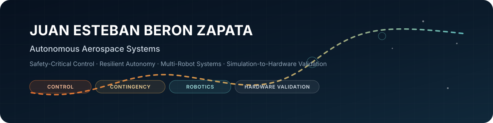

  

  <a href="https://kosmicplane.github.io"><b>Portfolio</b></a> ·
  <a href="https://www.linkedin.com/in/juan-esteban-beron"><b>LinkedIn</b></a> ·
  <a href="https://orcid.org/0009-0002-2350-7632"><b>ORCID</b></a> ·
  <a href="mailto:aeroberon@gmail.com"><b>Email</b></a>

## About

🚀 **Aeronautical Engineering graduate** working on autonomous aerospace systems for dynamic and degraded operating environments.

My work sits at the intersection of **safety-critical control, resilient autonomy, sensing and state estimation, multi-robot systems, and experimental validation**. I am especially interested in vehicles that can recognize changes in the environment or in their own operating capability, preserve safety, and select an appropriate contingency, reconfiguration, or recovery action while continuing the mission when feasible.

Across recent projects, I have worked with UAVs, spacecraft testbeds, communication-aware drone swarms, embedded sensing systems, flight-dynamics models, and simulation-to-hardware experiments.

## Research focus

- 🛡️ **Safety-critical control** — CBF/HOCBF, CLF, MPC, constrained control, funnel-based planning.
- 🔁 **Resilient autonomy** — contingency preservation, reconfiguration, fault-aware operation, dynamic environments.
- 🤖 **Multi-robot systems** — communication-aware coordination, swarm networking, topology adaptation.
- 📡 **Sensing & state estimation** — IMU/GNSS, visual/depth sensing, embedded telemetry, navigation interfaces.
- 🔬 **Experimental validation** — ROS 2, PX4, Gazebo, Isaac Sim, OptiTrack, Crazyflie, embedded hardware and field testing.

## Selected work

<b>🛡️ Safety & Contingency Certificates — Caltech / AMBER Lab</b>

 

[**Repository →**](https://github.com/kosmicplane/Safety-Contingency-Certificates) · [**Research portfolio →**](https://kosmicplane.github.io/research.html)

Contingency-aware autonomous landing in dynamic obstacle environments using **Poisson/PDE safety fields, control barrier and Lyapunov methods, MPC, and ellipsoidal funnels**. The work connects local safety and stabilization certificates with real-time route reconstruction and hardware experiments.

  
  

<b>📡 SWARMSYM / SNaaS Simulator — KAUST / NetLab</b>

 

[**Repository →**](https://github.com/kosmicplane/SNAAS_SYM-SNAAS-Simulator) · [**Research portfolio →**](https://kosmicplane.github.io/research.html)

A communication-aware multi-UAV simulation framework that couples **ROS 2, PX4-compatible execution, Isaac Sim, and NVIDIA Sionna** to study topology, link quality, routing, failures, standby integration, and recovery in airborne network infrastructure.

  
  

<b>🧭 SenDiMoniProg — National Central University</b>

 

[**Repository →**](https://github.com/kosmicplane/SenDiMoniProg-IMU) · [**Research portfolio →**](https://kosmicplane.github.io/research.html)

Embedded sensing and ROS 2 integration for **IMU, GNSS, Intel RealSense, Jetson-class hardware, ESP32 telemetry, MQTT/WebSocket transport, and navigation interfaces**. The project focuses on reliable sensor delivery, timing, calibration, and reproducible experiment workflows.

  
  

<b>🛰️ Atmospheric Probe Flight Dynamics & Multi-Pitot Sensing — UdeA</b>

 

[**Repository →**](https://github.com/kosmicplane/CUBE-SAT-FLIGHT-DYNAMICS-PITOTS) · [**Research portfolio →**](https://kosmicplane.github.io/research.html)

Flight-dynamics and sensing work for a CubeSat-class atmospheric probe, combining **descent modeling, multi-Pitot airflow reconstruction, atmospheric-property estimation, frame transformations, CFD/wind-tunnel testing, and post-flight data processing**.

  
  

## Technical toolkit

  
  
  
  
  
  
  
  

## Beyond engineering

✈️ Flight training & aviation · 🌍 Travel & exploration · 🌲 Nature · 🏊 Swimming & training

---

  <i>Autonomy becomes most valuable when a system must continue operating beyond nominal conditions.</i>

